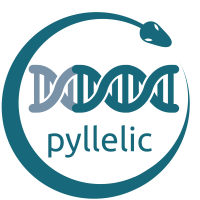

# pyllelic

[](https://lgtm.com/projects/g/Paradoxdruid/pyllelic/context:python)  [](https://www.codefactor.io/repository/github/paradoxdruid/pyllelic)  [](https://www.codacy.com/gh/Paradoxdruid/pyllelic/dashboard?utm_source=github.com&amp;utm_medium=referral&amp;utm_content=Paradoxdruid/pyllelic&amp;utm_campaign=Badge_Grade)  [](https://www.codacy.com/gh/Paradoxdruid/pyllelic/dashboard)  [](https://github.com/ambv/black)  [](https://pypi.org/project/pyllelic/) 

<p align="right">
  ⭐ &nbsp;&nbsp;the project to show your appreciation. :arrow_upper_right:
</p>



**pyllelic**: a tool for detection of allelic-specific methylation variation in bisulfite DNA sequencing files.

Pyllelic documention is available at **<https://paradoxdruid.github.io/pyllelic/>** and see [`pyllelic_notebook.ipynb`](https://github.com/Paradoxdruid/pyllelic/blob/master/pyllelic_notebook.md) for an interactive demonstration.

## Example exploratory use in jupyter notebook

<details>
<summary>Click to expand...</summary>

```python
    import pyllelic

    pyllelic.set_up_env_variables(  # Specify file and directory locations
        base_path="/Users/abonham/documents/test_allelic/",
        prom_file="TERT-promoter-genomic-sequence.txt",
        prom_start="1293000",
        prom_end="1296000",
        chrom="5",
    )

    pyllelic.setup_directories()  # Read env variables to set up directories to use

    files_set = pyllelic.make_list_of_bam_files()  # finds bam files

    positions = pyllelic.index_and_fetch(files_set)  # index bam and creates bam_output folders/files

    pyllelic.genome_parsing()  # writes out genome strings in bam_output folders

    cell_types = pyllelic.extract_cell_types(files_set)  # pulls out the cell types available for analysis

    df_list = pyllelic.run_quma_and_compile_list_of_df(cell_types, filename)  # run quma, get dfs

    means_df = pyllelic.process_means(df_list, positions, files_set)  # process means data from dataframes

    modes_df = pyllelic.process_modes(df_list, positions, cell_types)  # process modes data from dataframes
    
    diff_df = pyllelic.find_diffs(means_df, modes_df)  # find difference between mean and mode

    pyllelic.write_means_modes_diffs(means_df, modes_df, diffs_df, filename)  # write output data to excel files

    final_data = pyllelic.pd.read_excel(pyllelic.config.base_directory.joinpath(filename), dtype=str, index_col=0, engine="openpyxl")  # load saved data

    individual_data = pyllelic.return_individual_data(df_list, positions, files_set)  # load individual data sets

    pyllelic.histogram(individual_data, "CELL_LINE", "POSITION")  # visualize data for a point

    final_data.loc["CELL_LINE"]  # see summary data for a cell line
```

</details>

----------------------------------

## Dependencies and Installation

### Conda environment

* Create a new conda environment using python 3.7:

```bash
conda create --name PYLLELIC python=3.7
conda activate PYLLELIC
```

### Install pyllelic

```bash
pip install pyllelic
```

or

```bash
git clone https://github.com/Paradoxdruid/pyllelic.git
```

## Authors

This software is developed as academic software by [Dr. Andrew J. Bonham](https://github.com/Paradoxdruid) at the [Metropolitan State University of Denver](https://www.msudenver.edu). It is licensed under the GPL v3.0.

This software incorporates implementation from [QUMA](http://quma.cdb.riken.jp), licensed under the GPL v3.0.
